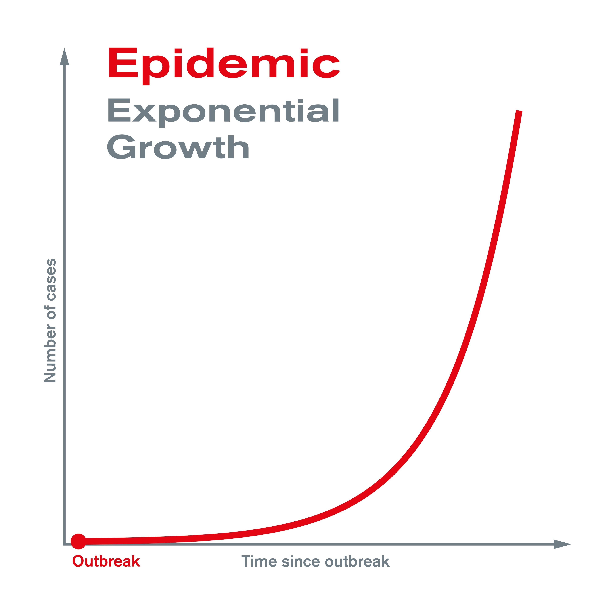

---
tags:
  - calculus
  - Differential_Equation
---
**自然常数 $e$ 之所以是微分方程的核心，是因为它描述了自然界最本质的一种变化规律。**

## 微分方程的自然案例

### 细菌繁殖

- **自然语言：** 增长的速度 正比于 当前的数量。
- **数学翻译：** $\frac{dy}{dt} = k \cdot y$
  - $\frac{dy}{dt}$ 是增长速度。
  - $y$ 是当前数量。
  - 这就是一个微分方程。
- **求解目的：** 通过这个“规则”，推导出 $y = Ce^{kt}$（预测未来的数量）。

### 弹簧振子

**自然语言：** 弹簧拉长的距离越远，想拉回来的力就越大（且方向相反）。

**数学翻译：** $F = -kx$ （胡克定律）。因为 $F=ma$，而加速度 $a$ 是位置 $x$ 的二阶导数 $x''$。

**最终方程：** $m \cdot x'' = -k \cdot x$

## 直觉角度

微分方程本质上是研究“变化率”（导数）**与**“当前状态”（函数值）之间的关系
微分方程：
$$\frac{dy}{dt} = y$$
自然语言是：**“一个东西增长的速度，完全等于它目前的数量。”**
自然常数 $e$ 是唯一一个能够完美满足“导数等于自身”的底数。
$$\frac{d}{dt} e^t = 1 \cdot e^t$$
在物理世界中，无论是细菌繁殖、放射性衰变，还是物体冷却，变化的速度往往都与当前的存量成正比。既然自然界的规律是“变化率与存量成正比”，那么描述这种规律的**天然语言**就是 $e$。

## 线性代数角度
特征向量（Eigenvector），对于矩阵 $A$，向量 $x$ 满足：[[特征值和特征向量#^5e1c29|特征向量]]
$$Ax = \lambda x$$
将求导（Differentiation）**看作一个线性算子（Linear Operator），记为 $D$。即寻找一个函数 $f(t)$，使得求导之后，函数的形式不变，只是被伸缩了：
$$D f(t) = \lambda f(t)$$
即：
$$\frac{d}{dt} f(t) = \lambda f(t)$$
指数函数 $e^{\lambda t}$ 就是微分算子 $D$ 的“特征向量”（本征函数 Eigenfunction）
这就是为什么解线性微分方程组时，我们总是假设解的形式是 $e^{\lambda t}$，然后去解 $\det(A - \lambda I) = 0$。因为 $e$ 是连接线性代数和微积分的桥梁。[[特征值和特征向量#^eb9473|特征向量的求解]]

## 复数角度：震荡也是 $e$
欧拉公式：
$$e^{ix} = \cos x + i \sin x$$
即使是旋转和震荡，在复数域中，它们本质上依然是指数运动。

- 实指数 $e^{at}$ 描述**增长/衰减**。
- 虚指数 $e^{i\omega t}$ 描述**旋转/震荡**。
所以，无论是热传导（衰减）还是波动方程（震荡），**所有的线性动态系统都是由$e$搭建起来的。**[[阻尼振动#^ef6510|震荡]]
