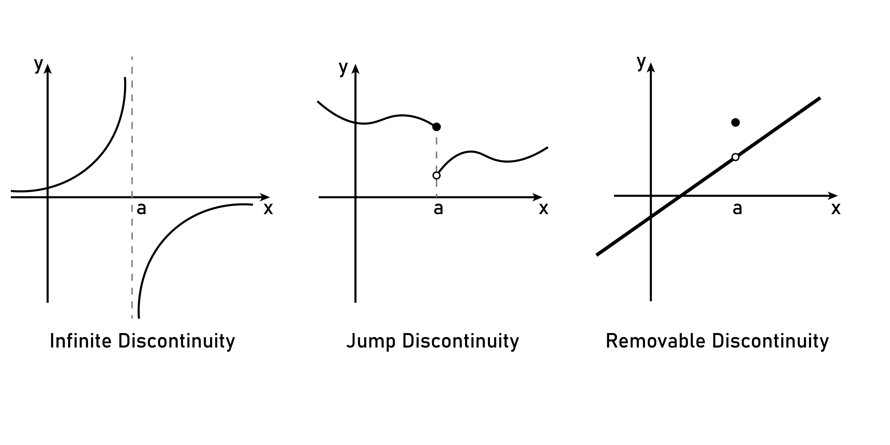

---
tags:
  - calculus
---

## 数列的极限

### 直观理解

考虑数列 $\{x_n\}$，其通项公式为：

$$x_n = \frac{n}{n+1}$$

我们将 $n = 1, 2, 3, ...$ 依次代入，可以看到数列的项为：

$$0.5, 0.666..., 0.75, 0.8, ..., 0.99, ...$$

观察现象：

随着 $n$（项数）变得越来越大（趋向于无穷大），$x_n$ 的数值正在无限地逼近 1。

虽然 $x_n$ 永远不会真正等于 1（因为它总是比 1 小一点点），但它与 1 的距离可以任意小。

在这种情况下，我们说当 $n$ 趋于无穷大时，数列 $\{x_n\}$ 的极限是 1。记作：

$$\lim_{n \to \infty} x_n = 1 \quad \text{或} \quad x_n \to 1 \; (n \to \infty)$$

### 精确定义

**定义：**

设 $\{x_n\}$ 为一个数列， $a$ 为一个常数。如果对于任意给定的正数 $\varepsilon$（不论它多么小），总存在一个正整数 $N$，使得对于所有 $n > N$ 的项，都有：

$$|x_n - a| < \varepsilon$$

则称常数 $a$ 是数列 $\{x_n\}$ 的极限。

#### 几何直观

- 不等式 $|x_n - a| < \varepsilon$ 等价于 $a - \varepsilon < x_n < a + \varepsilon$。

- 这表示 $x_n$ 落在了以 $a$ 为中心，半径为 $\varepsilon$ 的**邻域 (Neighborhood)** 内： $(a-\varepsilon, a+\varepsilon)$。

结论：

数列 $\{x_n\}$ 收敛于 $a$，几何上意味着：

无论你在这个点 $a$ 周围画多么窄的邻域，这个邻域之外，只可能有有限个数列的项（即前 $N$ 项）；而这个邻域之内，包含了数列中无限多个项（从 $N+1$ 开始的所有项）。

## 函数的连续

### 数学定义

定义函数 $f(x)$ 在点 $x_0$ 处是**连续**的，必须**同时满足**以下三个条件：

1. 有定义 (Defined):

   函数在 $x_0$ 这一点必须实实在在地存在。即 $f(x_0)$ 有意义。

2. 有极限 (Limit Exists):

   当 $x$ 从左右两边无限趋近于 $x_0$ 时，目标必须一致。即 $\lim_{x \to x_0} f(x)$ 存在。

3. 极值等于函数值 (Limit equals Value):

   趋近的目标（极限），必须恰好等于该点的实际值。

   

   $$\lim_{x \to x_0} f(x) = f(x_0)$$

### 间断点

#### 第一类间断点（左右极限都存在）

1. **可去间断点 (Removable Discontinuity):**
   - **现象：** 图像上有一个“空心圈”（漏洞）。极限存在，但该点无定义，或者定义在别处。
2. **跳跃间断点 (Jump Discontinuity):**
   - **现象：** 左极限 $\neq$ 右极限。图像断开，产生了一个“台阶”。
   - **应用：** 就像数字电路中的**方波信号**，电平从 0 瞬间跳变为 1。

#### 第二类间断点（左右极限至少有一个不存在）

1. **无穷间断点 (Infinite Discontinuity):**

   - **现象：** 函数值在该点趋向于无穷大（垂直渐近线）。

   - **例子：** $f(x) = \frac{1}{x}$ 在 $x=0$ 处。

     

     2. **震荡间断点**

     ### 连续函数的性质

     

     #### **介值定理 (Intermediate Value Theorem)**

     如果函数 $f(x)$ 在闭区间 $[a, b]$ 上连续，且 $f(a)$ 和 $f(b)$ 也就是一头一尾的值不一样。那么，在 $f(a)$ 和 $f(b)$ 之间的**任何一个数值**，都一定能在区间里找到至少一个对应的 $x$。
