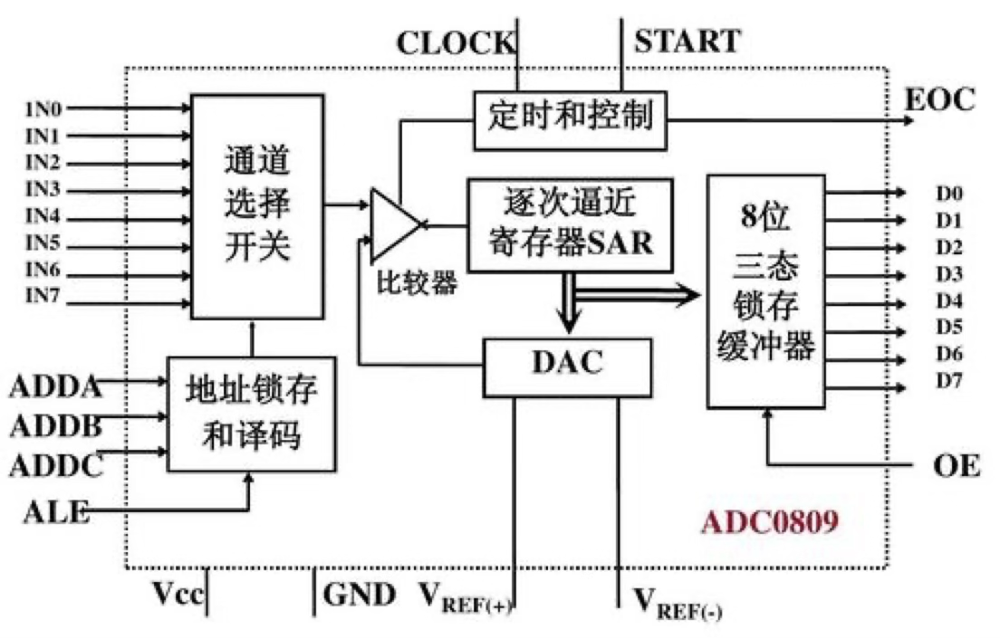

---
tags:
  - stm32
  - 标准库
---

 ## 简介

- ADC（Analog-Digital Converter） 模拟-数字转换器
- ADC可以将引脚上连续变化的模拟电压转换为内存中存储的数字变量[[基本公式和定理#^b60fca|数字信号只有高低电平]]
- 12位逐次逼近型（工作模式）ADC，1us转换时间（最快转换频率）
- 输入电压范围：0~3.3V，转换结果范围：0~4095（12位分辨率）
- STM32F103C8T6 ADC资源：ADC1、ADC2，10个外部输入通道

## 逐次逼近型ADC

1. IN0～IN7是8路输入通道，选中一路进行转换（stm32输入通道更多）
2. 地址锁存用来选择 某一路开关
3. 电压比较器判断输入信号的电压大小关系，输出高低电平

4. SAR的作用：**调整DAC电压与外部通道输入的电压近似相等**，使用二分法
5. 参考电压同时是ADC和DAC的参考电压
