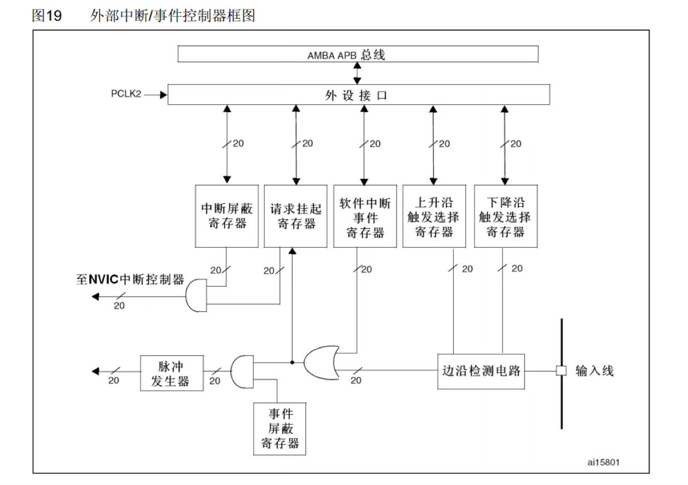
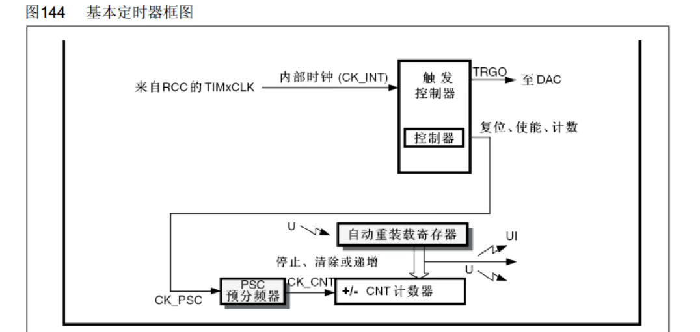
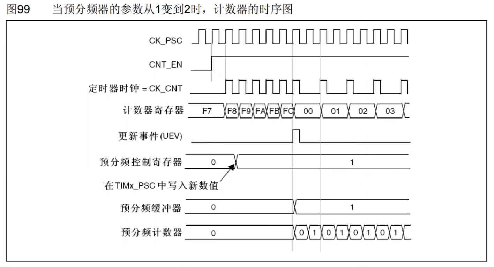

---
tags:
  - stm32
  - 标准库
---

# EXIT外部中断

## 中断系统

- **中断：** 在主程序运行过程中，出现了特定的中断触发条件（中断源），使得CPU暂停当前正在运行的程序，转而去处理中断程序，处理完成后又返回原来被暂停的位置继续运行
- **中断优先级：** 当有多个中断源同时申请中断时，CPU会根据中断源的轻重缓急进行裁决，优先响应更加紧急的中断源
- **中断嵌套：** 当一个中断程序正在运行时，又有新的更高优先级的中断源申请中断，CPU再次暂停当前中断程序，转而去处理新的中断程序，处理完成后依次进行返回

## NVIC

NVIC根据每个中断的优先级进行中断分配的任务

### 优先级分组

| **分组方式** | **抢占优先级**  | **响应优先级**  |
| ------------ | --------------- | --------------- |
| **分组0**    | 0位，取值为0    | 4位，取值为0~15 |
| **分组1**    | 1位，取值为0~1  | 3位，取值为0~7  |
| **分组2**    | 2位，取值为0~3  | 2位，取值为0~3  |
| **分组3**    | 3位，取值为0~7  | 1位，取值为0~1  |
| **分组4**    | 4位，取值为0~15 | 0位，取值为0    |

1. 响应优先级可以优先排队
2. 抢占优先级可以中断嵌套
3. 两者均相同的话，按照中断号排队

## EXTI中断

### 简介

EXTI监测电平变化，发出中断申请。

支持所有GPIO口，但是相同的pin不能够同时触发中断

事件响应：监测到电平变化后，可以选择触发事件，中断信号不会通向CPU，而是通向其它外设，触发其它外设操作。[[ADC转换]]

### 基本结构

AFIO选择16个引脚中的一个，相同的pin经过选择后，只有一个能够连接到EXTI的通道上。（数据选择器）

# TIM定时中断

## 简介

- **TIM (Timer) 定时器**

​	定时器可以对输入的时钟进行计数，并在计数值达到设定值时触发**中断**

- **16位计数器、预分频器、自动重装寄存器**的时基单元，在72MHz计数时钟下可以实现最大59.65s的定时

### 时基单元

最大定时的计算：

1. **资源限制**：STM32 的计数器是 **16位** 的，这意味着它最多只能数到 $2^{16} = 65536$ 个数。

2. **预分频器 (PSC)**：可以把 72MHz 的高频时钟“降频”。如果将 72MHz 分频 65536 倍（最大分频值），时钟频率就变成了 $\approx 1098 \text{ Hz}$（即 1 秒数 1098 下）。

3. **计数时长**：用慢下来的频率去数满 65536 个数（自动重装值 ARR），所需时间就是：$$T_{max} = \frac{1}{72000000} \times 65536 \text{ (PSC)} \times 65536 \text{ (ARR)} \approx 59.65 \text{ 秒}$$

### 定时器类型

| **类型**       | **编号**               | **总线** | **功能**                                                     |
| -------------- | ---------------------- | -------- | ------------------------------------------------------------ |
| **高级定时器** | TIM1、TIM8             | APB2     | 拥有通用定时器全部功能，并额外具有重复计数器、死区生成、互补输出、刹车输入等功能 |
| **通用定时器** | TIM2、TIM3、TIM4、TIM5 | APB1     | 拥有基本定时器全部功能，并额外具有内外时钟源选择、输入捕获、输出比较、编码器接口、主从触发模式等功能 |
| **基本定时器** | TIM6、TIM7             | APB1     | 拥有定时中断、主模式触发DAC的功能                            |

- **STM32F103C8T6 定时器资源**：TIM1、TIM2、TIM3、TIM4。

 

#### 基本定时器

- CNT计数器的值在计数过程中自增运行，当自增运行到目标值时，产生中断
- 自动重装寄存器：计数值等于自动重装寄存器时，计时时间到产生中断信号 ，清零计数器（更新中断）
- 基本计时器只支持向上计数的方式

#### 通用计时器

1. 通用计时器支持向下计数、中央对齐的方式
2. 可以选择外部时钟

##### 外部引脚时钟

- 外部时钟模式2:ETR外部时钟
- 外部时钟模式1:TRGI当作外部时钟使用

## 时序图

### 预分频器

- CNT-EN计数器高电平运行，低电平计数停止

### 计数器时序

1. 更新中断标志置1申请中断
