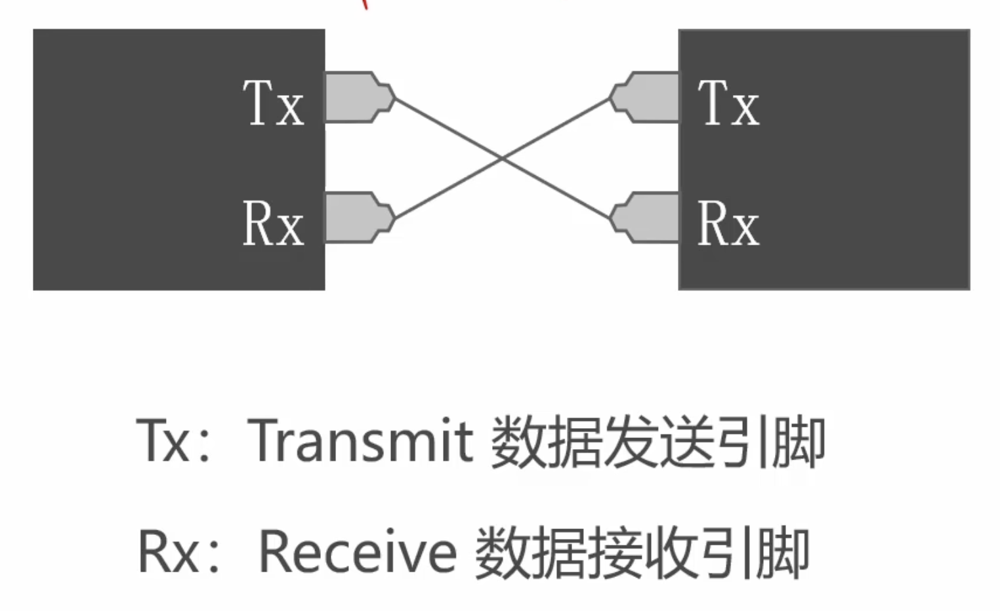
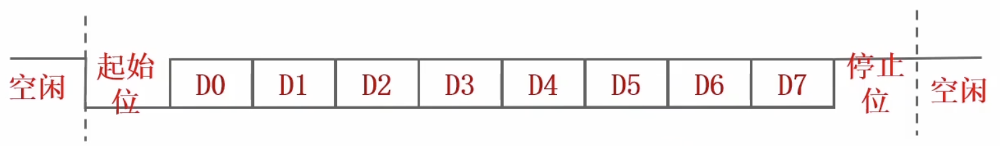
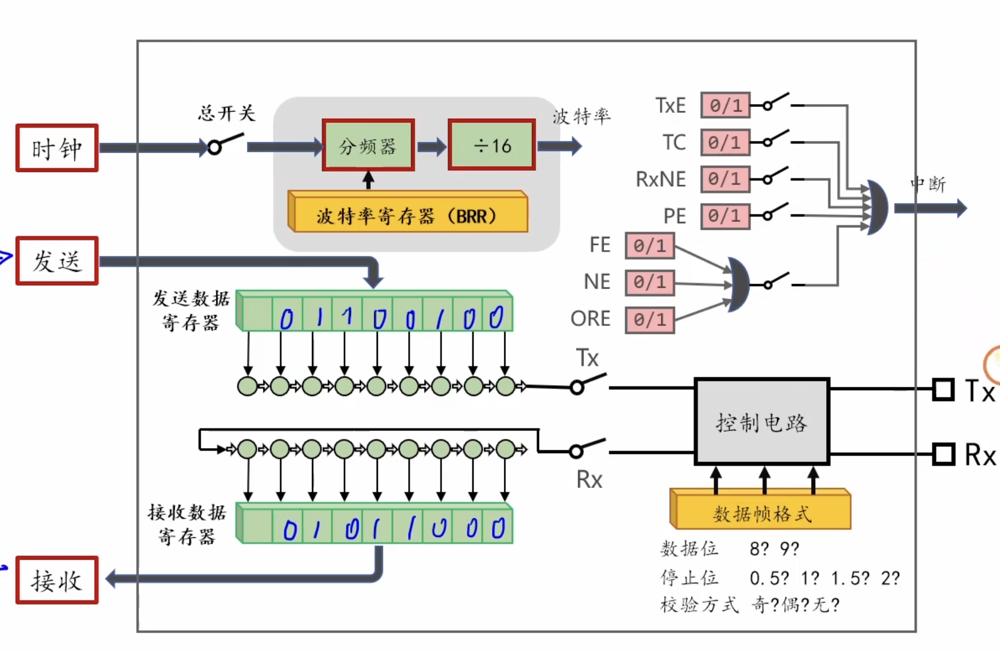
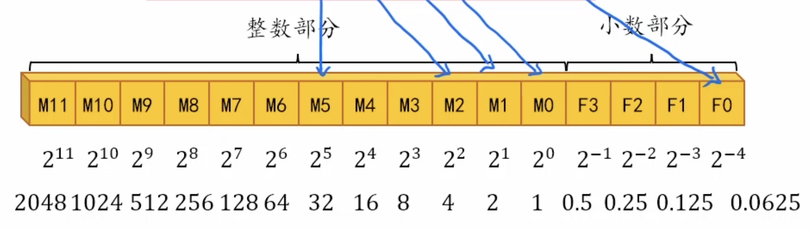
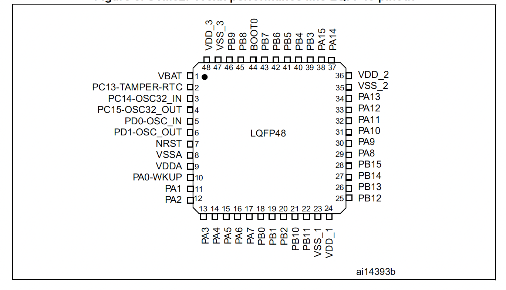
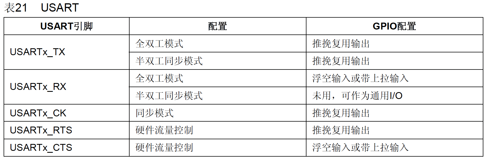

---
tags:
  - stm32
---

## 通信协议

- 串口是一种通信接口，用于传输数据
- 串口想要在导线上传输数据，需要遵从一定的数据格式。
- 数据传输的格式，就是串口的通信协议。



1. 导线上传输高低变化的电压
2. 串口在不传输数据是是空闲状态（高电压）
3. 发送方发送低电压（起始位）表示数据传输的开始
4. 每次传输一个字节的数据，传输过程从最低位到最高位（高电压表示1[[基本公式和定理#^b60fca|数字信号的表示]]）
5. 数据传输结束后发送高电压（截止位）
6. 数据传输过程中**低位先行**

### 数据传输示意图



### 串口数据帧的类型

- 数据位可以有8～9位
- 检验位检验传输过程中是否出错（检验位可以不存在）
- 停止位可以设置成其它值

### 校验方式

1. 奇校验：要求数据位中有奇数个1。
2. 偶校验：要求数据位中有偶数个1。


## USAERT模块

### 简介

- USART是单片机中的串口

- USART既能发送信息，也能接收信息

### 基本用法



- 将要发送的数据写入寄存器即可发送数据（数据从TX引脚以数据帧的格式发送）
- 解析通过RX引脚接受的数据帧的波形即可接收数据到寄存器中
- 总开关控制USART模块的使能与禁止

### 移位寄存器和串并转换

上方的移位寄存器将并行数据转换为串行，下方相反

- 并行：多个比特位一起（发送数据时比特位同时存储在发送数据寄存器中）

- 串行：一个比特位进行操作（发送数据时比特位一个一个发送）

移位寄存器每一个周期移动一位**（数据帧传输的过程中低位先行的原因）**

### 数据帧格式的设置方法

1. 控制电路控制数据帧的格式
2. 数据帧格式用于设置参数

### 波特率设置方法

- 波特率：每秒钟最多输入多少位，发送的位越多，数据传输速度越快

- 波特率控制器用于设置分频器的分频系数



控制器中填入的数据用来改变分频系数

### 编程接口

#### 串口初始化

```c
void USART_Init(USARTTypeDef *USARTx,          //串口名称
                USART_InitTypeDef *USART_InistStruct); //初始化的参数
```

#### 代码封装

```c
struct USART_InitTypeDef{

    uint32_t USART_BaudRate;    // 波特率（直接填入想要的波特率）

    uint16_t USART_WordLength;  // 数据位长度
                                // - USART_WordLength_8b
                                // - USART_WordLength_9b

    uint16_t USART_StopBits;    // 停止位长度
                                // - USART_StopBits_0_5
                                // - USART_StopBits_1
                                // - USART_StopBits_1_5
                                // - USART_StopBits_2

    uint16_t USART_Parity;      // 校验方式
                                // - USART_Parity_No
                                // - USART_Parity_Even
                                // - USART_Parity_Odd

    uint16_t USART_Mode;        // 数据收发方向  
                                // - USART_Mode_Tx
                                // - USART_Mode_Rx
                                // - USART_Mode_Tx | USART_Mode_Rx
}
```

USART_Mode控制的是TX开关与RX开关的闭合


## 初始化IO引脚

### USART的引脚

- 标准模块功能：TX引脚和RX引脚
- 硬件流控：CTS引脚和RTSS引脚
- 同步模式：连接CK引脚用于串口的同步模式

### 引脚分布表



- PA9可以作为USART1_TX使用，PA10可以作为USART1_RX使用

### 重映射表

 重映射用于默认引脚无法使用时，（可以查阅手册看对应片上外设）

### IO配置表



- 全双工：数据通信的方向完全是双向的（标准串口基础）
- 半双工：方向是双向的，但是不能同时进行（两个模块的TS引脚相互连接，共用一根线）
- 同步：在标准的串口基础上，增加了CK线（传输时钟信号，同步两个设备）
- 硬件流控：在标准的串口基础上，增加了CTS和RTS交叉连接

#### GPIO配置

1. RX引脚选择上拉输入，保证串口数据帧处于空闲状态[[GPIO原理#^c3df2c|默认高电平]]


## 发送数据

### TxE标志位

**TxE: Transmit Data Register Empty - 发送数据寄存器空**

- 当 TDR（发送数据寄存器）空时，TxE = 1；
- 否则 TxE = 0。
- **如果不进行判断，可能会导致新写入的数据把原来的数据覆盖掉**

### TC标志位

**TC: Transmit Complete - 发送完成**

- 当 TDR（发送数据寄存器）空 **且** 移位寄存器空时，TC = 1；（移位寄存器中是正在被发送的数据）
- 否则 TC = 0。

### 编程接口

#### 开关接口

```c
void USART_Cmd(USARTTypeDef *USARTx,    // 串口名称
               FunctionalState NewState // ENABLE-使能; DISABLE-禁止
              );
```

- **作用**：控制 USART 模块的使能和禁止。
- **地位**：它是 USART 外设的 **“总开关”**。

------

**使用提示：** 在使用 `USART_Init` 初始化好结构体参数后，**必须**调用这个函数并传入 `ENABLE`，串口才会开始工作。如果传入 `DISABLE`，串口将停止工作，常用于低功耗处理。

#### 查询标志位值

```c
FlagStatus USART_GetFlagStatus(USARTTypeDef *USARTx, // 串口名称
                               uint16_t USART_FLAG   // 要查询的标志位
                              );
```

- **作用**：查询 USART 标志位的值。
- **返回值**：
  - **RESET (0)**：标志位未置位。
  - **SET (1)**：标志位已置位。
  - 使用布尔型SET进行判断（0或1可能是整型）
- 实际应用：
  - **检查是否可以发送数据**：调用此函数查询 `USART_FLAG_TXE`。如果返回 `SET`，说明 TDR 空了，可以写入新数据。
  - **检查是否发送结束**：调用此函数查询 `USART_FLAG_TC`。如果返回 `SET`，说明数据完全发完了。

#### 发送数据

```c
void USART_SendData(USARTTypeDef *USARTx, // 串口名称
                    uint16_t Data         // 要发送的数据,可能是9位数据位，因此使用无符号16位整型
                   );
```

- **作用**：把要发送的数据写入到发送数据寄存器 (TDR) 里。


