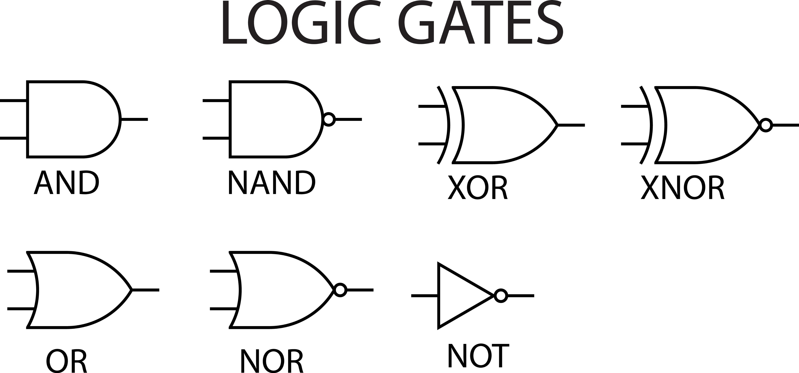

---
tags:
  - 数字电子技术
---

## 逻辑运算

**逻辑运算**（Logical Operation）是处理数字信号的核心方式。将电压视为“真”（1）或“假”（0）两种状态，并根据特定的规则进行计算。

### 三种最基本的逻辑运算

任何复杂的数字系统（如 CPU）都是由这三种基本运算组合而成的：

- **与（AND）运算：** 逻辑乘法。只有当所有输入都为“1”时，输出才为“1”；只要有一个输入为“0”，输出即为“0”。
- **或（OR）运算：** 逻辑加法。只要输入中有一个或多个为“1”，输出就为“1”；只有当所有输入都为“0”时，输出才为“0”。
- **非（NOT）运算：** 逻辑否定（求反）。输出状态始终与输入状态相反：输入为“1”，输出为“0”；输入为“0”，输出为“1”。

### 复合逻辑运算

将基本运算组合成常用的复合运算：

- **与非（NAND）/ 或非（NOR）：** “与”或“或”运算后再进行一次“非”运算，它们被称为**全能门**，可以实现所有其他逻辑。
- **异或（XOR）：** 当两个输入不同（一个 0 一个 1）时，输出为 1；若输入相同，输出为 0。常用于加法器和奇偶校验。
- **同或（XNOR）：** “异或”的取反，只有当输入相同时，输出才为 1。

### 3. 描述逻辑运算的工具

为了精确表达这些运算关系，通常使用以下工具：

- **真值表（Truth Table）：** 列出所有可能的输入组合及其对应输出的表格。
- **逻辑表达式：** 使用布尔代数符号（如 $Y = A \cdot B$ 表示与，$Y = A + B$ 表示或）书写的数学公式。
- **逻辑符号：** 在电路图中使用特定的图形代表不同的逻辑门。

## 布尔恒等式表格

| **定律名称**                | **或（OR）形式**                         | **与（AND）形式**                           | **简要说明**                     |
| --------------------------- | ---------------------------------------- | ------------------------------------------- | -------------------------------- |
| **同一律 (Identity)**       | $A + 0 = A$                              | $A \cdot 1 = A$                             | 与 0 或、与 1 与，结果不变       |
| **支配律 (Domination)**     | $A + 1 = 1$                              | $A \cdot 0 = 0$                             | 与 1 或必为 1，与 0 与必为 0     |
| **幂等律 (Idempotent)**     | $A + A = A$                              | $A \cdot A = A$                             | 变量与自身运算，结果仍为自身     |
| **互补律 (Complement)**     | $A + \bar{A} = 1$                        | $A \cdot \bar{A} = 0$                       | 变量与反变量必有一真一假         |
| **双重否定律 (Involution)** | $\bar{\bar{A}} = A$                      | —                                           | 两次取反等于原值                 |
| **交换律 (Commutative)**    | $A+B = B+A$                              | $A \cdot B = B \cdot A$                     | 输入变量的顺序不影响结果         |
| **结合律 (Associative)**    | $(A+B)+C = A+(B+C)$                      | $(A \cdot B) \cdot C = A \cdot (B \cdot C)$ | 运算的分组方式不影响结果         |
| **分配律 (Distributive)**   | $A+(B \cdot C) = (A+B)(A+C)$             | $A(B+C) = AB + AC$                          | 注意：左侧公式在普通代数中不成立 |
| **吸收律 (Absorption)**     | $A + AB = A$                             | $A(A+B) = A$                                | 短项“吸收”长项                   |
| **德·摩根定律 (De Morgan)** | $\overline{A+B} = \bar{A} \cdot \bar{B}$ | $\overline{A \cdot B} = \bar{A} + \bar{B}$  | “断法号，变符号”                 |

1. **优先级：** 在复合逻辑表达式中，运算优先级通常为：**括号 > 非 > 与 > 或**。

2. **对偶原理：** 如果一个布尔恒等式成立，那么将其中的 $0$ 与 $1$ 互换、且“与”与“或”互换后得到的**对偶式**也一定成立。

3. **电路简化：** 吸收律和德·摩根定律是简化复杂电路、减少逻辑门数量的最常用手段。

## 逻辑代数基本定理

### 代入定理

> **如果两个逻辑表达式恒等（对所有输入都相同），那你可以在任何更大的表达式里，用其中一个去替换另一个，而不会改变整体逻辑功能。**

#### 标准表述

设 $F(\cdot)$ 是任意布尔函数（由 $+$、$\cdot$、$\overline{\ \ }$ 等组成）。若对所有取值都有：
$$
X \equiv Y
$$
那么就有：
$$
F(X) \equiv F(Y)
$$
更一般地，如果有一个大表达式 $G$，里面出现了某个子表达式 $X$，并且$X \equiv Y$，那么：
$$
G(\ldots, X, \ldots) \equiv G(\ldots, Y, \ldots)
$$

#### 直觉理解

布尔表达式最终对应的是“真值表”。 如果 $X$ 和 $Y$ 的真值表一模一样，那在任何电路/表达式里把 $X$ 换成 $Y$，外层看到的只是“同一根信号线”的行为——输出不变。

### 反演定理

对任意布尔表达式 $F$，它的反函数（补）$\overline{F}$ 可以这样得到：

> **把表达式里所有的 $+$ 和 $\cdot$ 互换，并把所有变量都取反（0↔1 也互换），就得到原式的反。**

### 标准表述

如果 $F$ 是由 $+$、$\cdot$、$\overline{\ \ }$ 以及常量 0/1 构成的布尔表达式，那么：
$$
\overline{F(A,B,\ldots)} = F^{*}(\overline{A},\overline{B},\ldots)
$$
其中 $F^{*}$ 表示 $F$ 的**对偶式**（把 $+$ 与 $\cdot$、0 与 1 互换得到）。

## 逻辑函数及其表示方法

