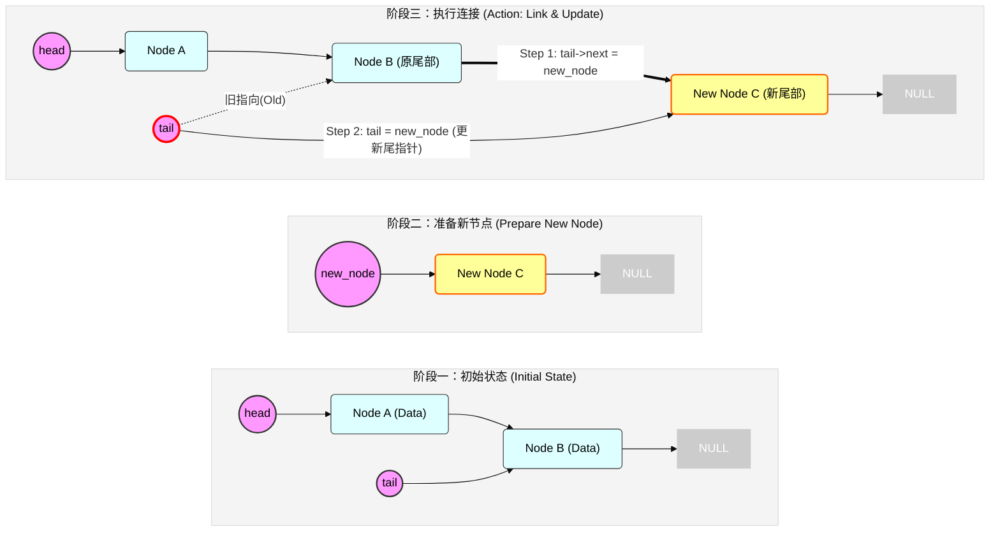
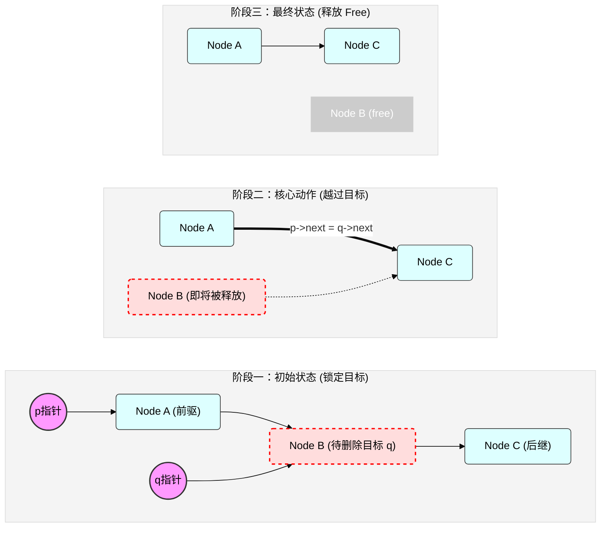
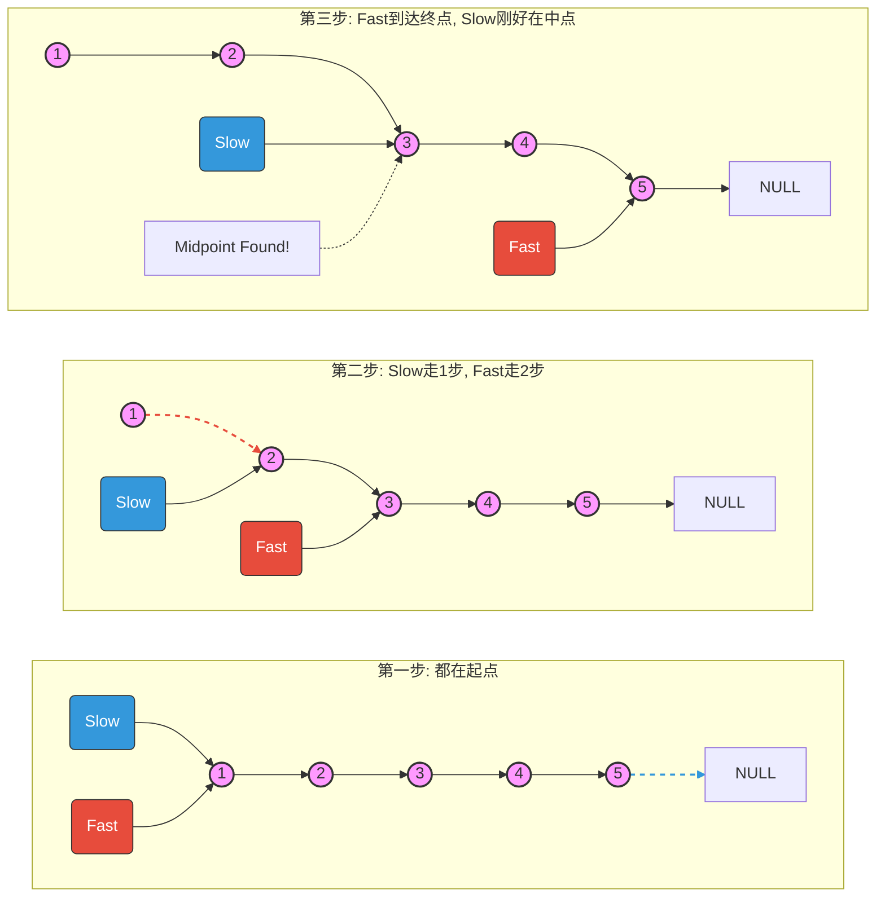
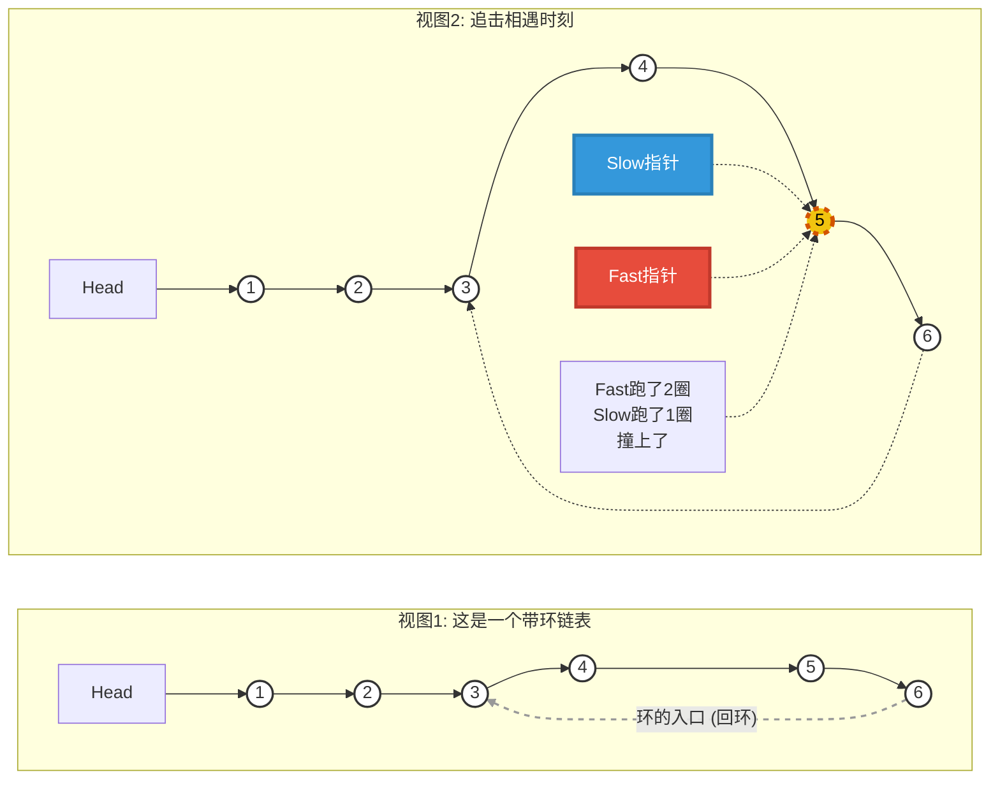

---
tags:
  - c语言
  - DataStructure
---


## 链表的基本概念


### 离散与链接

**离散存储**：数据在内存中不再需要挨在一起，它们可以分散在内存的各个角落（随机分布）。

**链接（Link）**：为了能找到下一个数据，每个数据节点里必须有指针指向下一个数据的**地址**。


### 基本单元：结点 (Node)

链表是由一个个**结点**串联起来的。在 C 语言中，一个结点通常包含两部分：

1. **数据域 (Data Field)**：存放真正的数据（比如 `int`, `student_info`）。
2. **指针域 (Pointer Field)**：存放下一个结点的**地址**（指向下一个结点）。


### 链表的代码结构

```c
typedef struct Node {
    int data;              // 数据域：存数据
    struct Node *next;     // 指针域：存下一个结点的地址
} LNode, *LinkList;
```

- **注意：** 这里的 `next` 指针类型必须是 `struct Node*`，因为它指向的是一个和自己一模一样的结构体。
- `*LinkList`是一个结构体指针的理解：[[关键字#^842fec|typedef定义结构体指针]]，[[补充笔记#^8047a0|声明原因]]


## 链表的初始化

创建一个“头结点”，并让 `LinkList` 指针指向它。


### 初始化的两种方式

**带头结点**和**不带头结点**。


#### 带“头节点”的链表

- **头指针 (Head Pointer)**：变量 `L`。它永远指向链表的第一个位置。
- **头结点 (Head Node)**：这是我们人为在链表最前面加的一个“哨兵结点”。
  - **特点**：**不存数据**（或者存链表长度），它的 `next` 指向真正的第一个存数据的结点。
  - **作用**：为了统一操作。有了它，第一个结点和第十个结点的地位就一样了，不需要单独为“第一个结点”写特殊的 `if` 判断。

图像示意：


### 带头节点初始化

```c
// 定义链表结构
typedef struct Node {
    int data;
    struct Node *next;
} LNode, *LinkList;

// 初始化函数：目的是返回一个初始化好的空链表
LinkList InitList() {
    // 1. 申请内存：创建一个头结点
    // L 此时是指向头结点的指针
    LinkList L = (LinkList)malloc(sizeof(LNode));
    
    // 2. 内存检查：万一内存申请失败
    if (L == NULL) {
        return NULL; // 内存不足，初始化失败
    }
    
    // 3. 核心步骤：将头结点的 next 指向 NULL
    // 这代表后面没有元素了，这是一个空表
    L->next = NULL;
    
    return L;
}

// 主函数调用
int main() {
    LinkList L;      // 此时 L 是野指针
    L = InitList();  // 现在 L 指向了一个合法的头结点
    return 0;
}
```


### 不带头节点初始化

如果不带头结点，`L` 直接指向第一个真实数据。那么初始化时，链表是一个“空”。

```c
void InitList(LinkList *L) {
    *L = NULL; // 这是一个彻底的空指针，连头结点都没有
}
```

- **缺点**：因为 `L` 可能是 `NULL`，之后你每次往链表插入第一个元素时，都要判断 `if (L == NULL)。


### 初始化后的链表

执行完带头结点的初始化后，内存：

| **变量/内存**  | **状态**                                                     |
| -------------- | ------------------------------------------------------------ |
| **L (头指针)** | 拿着一个地址（比如 `0x100`），指向头结点。                   |
| **L->data**    | **垃圾值**（在这个头结点里，数据域我们是不用的，存啥都行）。 |
| **L->next**    | **NULL**                                                     |


# 链表添加元素


## 头插法

核心特点：**新来的元素，永远排在最前面**

插入数据和输出的排列的顺序相反

#### 代码实现

```c
// 头插法建立单链表
// 返回值：建立好的链表头指针
LinkList List_HeadInsert(LinkList L) {
    LNode *s;   // s 用来指向新申请的结点
    int x;      // x 用来存用户输入的数字
    
    // 1. 初始化头结点（假设传入的 L 还没初始化，如果已初始化这步可省）
    L = (LinkList)malloc(sizeof(LNode));
    L->next = NULL; // 初始为空链表，这一步极其重要！

    printf("请输入数字(输入9999结束): \n");
    scanf("%d", &x);

    // 2. 循环插入
    while (x != 9999) {
        s = (LNode*)malloc(sizeof(LNode)); // 申请新内存
        s->data = x;                       // 存入数据
        
        // 【核心两步】
        s->next = L->next; // 让新结点 s 指向原本的“第一名”
        L->next = s;       // 让头结点 L 指向新结点 s
        
        scanf("%d", &x); // 继续读下一个数
    }
    
    return L;
}
```


#### 头插法的应用

1. **需要逆序输出**：比如从文件读数据，想倒着存。

2. **实现“栈” (Stack)**：栈的特点是“后进先出”，和头插法的逻辑一样。

3. **链表逆置**：“反转一个链表”，其实就是把旧链表的节点拆下来，用头插法插到一个新头结点后面。


## 链表的遍历


### 代码实现

```c
/**
 * 遍历打印链表
 * @param L 链表的头指针
 */
void PrintList(LinkList L) {
    // 1. 定义替身指针 p
    // 让 p 指向第一个【有效节点】（跳过头结点）
    LNode *p = L->next; 
    
    // 2. 循环条件：只要 p 还没指到 NULL，就继续走
    while (p != NULL) {
        // --- 可以在这里做任何你想做的事 ---
        printf("%d -> ", p->data); // 比如：打印数据
        // -------------------------------
        
        // 3. 关键一步：p 走向下一个节点
        p = p->next; 
    }
    
    printf("NULL\n"); // 打印结束标志，为了好看
}
```


### 常见错误


#### 错误一：从头结点开始打印

如果写 `LNode *p = L;`，那么循环第一次会打印头结点的数据。

- **后果**：会打印出一个垃圾值（乱码），因为头结点的数据域是没初始化的。


#### 错误二：移动`L`

```c
void BadPrint(LinkList L) {
    while (L->next != NULL) {
        printf("%d", L->next->data);
        L = L->next; // 存在内存泄漏风险
    }
}
```


### 遍历的应用

求链表长度：

```c
int ListLength(LinkList L) {
    LNode *p = L->next; // 从第一个真节点开始
    int len = 0;        // 计数器
    
    while (p != NULL) {
        len++;          // 只要 p 还在，长度加 1
        p = p->next;    // 往后走
    }
    return len;
}
```


## 尾插法

核心特点：**新来的元素排在队伍最后面。**


#### 核心难点

在“头插法”中，我们总是插在头结点后面，所以只需要知道头结点 `L` 在哪就行。

但是在“尾插法”中，需要把新元素接到链表的**最末尾**。

- **复杂办法**：每次都从头结点 `L` 开始往后找，走到最后一名，然后贴上去。这样效率低（$O(n^2)$）。
- **简便办法**：找一个指针 **`r`**，即 Rear，永远指着当前的“最后一名”。有新元素，将 `r` 移到新元素上。


#### 尾指针`r`

**初始状态**：链表是空的，只有头结点。所以“最后一名”就是头结点。即 `r = L;`

**插入过程**：

1. 存在新结点 `s` 
2. `r->next = s;` 
3. `r = s;` （`r` 移动到 `s` 身上，因为 `s` 变成了新的末尾）。


#### `mermaid`演示




#### 代码实现

```c
// 尾插法建立单链表
// 返回值：建立好的链表头指针
LinkList List_TailInsert(LinkList L) {
    int x; // 存储输入的值
    
    // 1. 初始化头结点
    L = (LinkList)malloc(sizeof(LNode));
    LNode *s;        // s 指向新结点
    LNode *r = L;    // r 是尾指针，初始时指向头结点！
    
    printf("请输入数字(输入9999结束): \n");
    scanf("%d", &x);
    
    // 2. 循环插入
    while (x != 9999) {
        s = (LNode*)malloc(sizeof(LNode));
        s->data = x;
        
        // 【核心两步】
        r->next = s; // 1. 把新结点挂在老尾巴后面
        r = s;       // 2. r 移动，指向新的尾巴
        
        scanf("%d", &x);
    }
    
    // 3. 收尾（非常重要！）
    // 此时 r 指向的是最后一个结点，必须把它的 next 封死，否则是野指针
    r->next = NULL; 
    
    return L;
}
```


### 两种方法的对比

| **特性**       | **头插法 (Head Insert)**           | **尾插法 (Tail Insert)**           |
| -------------- | ---------------------------------- | ---------------------------------- |
| **顺序**       | **逆序** (输入的 1,2,3 变成 3,2,1) | **正序** (输入的 1,2,3 还是 1,2,3) |
| **指针需求**   | 只需要头指针 `L`                   | 需要头指针 `L` + **尾指针 `r`**    |
| **时间复杂度** | $O(n)$                             | $O(n)$                             |
| **核心操作**   | 插队到第一名                       | 排队到最后一名                     |
| **适用场景**   | 链表逆置、栈                       | 正常的列表构建、队列               |


## 链表的指定位置插入

**核心原则：先连后断**

必须先将 **新节点的 next** 指向 **后继节点**， 然后才能将 **前驱节点的 next** 指向 **新节点**。 *(如果反过来，就会丢失后继节点的地址，链表就断了)*


### `mermaid`演示




### 代码实现

```c
/*
 * 在指定位置 index 插入元素 data
 * index: 插入位置的索引 (0, 1, 2...)
 * 返回值: 成功返回 1，失败（位置非法）返回 0
 */
int insert_at(Node** head_ref, int index, int data) {
    // 1. 准备新节点
    Node* new_node = (Node*)malloc(sizeof(Node));
    if (new_node == NULL) return 0; // 内存分配失败
    new_node->data = data;

    // 2. 情况一：插入头部 (index == 0)
    // 这是特殊情况，因为没有“前驱节点”
    if (index == 0) {
        new_node->next = *head_ref; // 新节点指向旧头
        *head_ref = new_node;       // 更新头指针
        return 1;
    }

    // 3. 情况二：插入中间或尾部
    // 我们需要找到第 index-1 个节点 (前驱节点 p)
    Node* p = *head_ref;
    int k = 0;
    
    // 遍历链表，直到 p 指向第 index-1 个位置
    // 且 p 不能为 NULL (防止 index 越界)
    while (p != NULL && k < index - 1) {
        p = p->next;
        k++;
    }

    // 如果 p 是 NULL，说明 index 太大了（比如链表长5，你想插到第100个位置）
    if (p == NULL) {
        free(new_node); // 既然没插进去，记得释放内存
        return 0; 
    }

    // 4. 核心操作 (对应 Mermaid 图)
    // 【口诀：先连后断】
    // 此时 p 就是图中的 Node A
    
    // ① 右手牵住后面的 (图中的 Step 1)
    new_node->next = p->next; 
    
    // ② 左手被前面的牵住 (图中的 Step 2)
    p->next = new_node;       

    return 1;
}
```

假设要将数据插入到第 `i` 个位置（从 0 开始计数）。

#### 步骤解析：

1. **特判**：如果 `i == 0`（头插法），逻辑不一样，需要修改 `head` 指针本身。
2. **寻找前驱**：需要找到第 `i-1` 个节点。因为单链表只能单向走，要操作第 `i` 个位置，必须停在 `i-1`。
3. **操作**：执行上图中的“先连后断”。


## 删除节点

**找到前驱节点（Predecessor）**。因为单链表只能单向移动，只有站在“前一个”节点的位置，才能修改指针绕过“目标”节点。


### 操作步骤:

假设有 A -> B -> C -> D，现在要删除 **B**：

1. **定位**：找到 B 的前驱节点 **A**。
2. **重连**：将 A 的 `next` 指针，直接指向 B 的后继节点 **C**。
   - 操作前：`A->next` 是 B
   - 操作后：`A->next` 变成 `B->next` (也就是 C)
3. **释放**：使用 `free(B)` 释放 B 占用的内存（否则内存泄漏）。

### 代码实现

```c
/**
 * 删除链表中第一个值为 val 的节点
 * @param head 链表的头指针
 * @param val 要删除的目标值
 * @return 删除后的新头指针 
 **/
    // 2. 情况一：如果要删除的是头节点
    if (head->data == val) {
        Node* temp = head;      // 先暂时抓住这个节点，防止丢失
        head = head->next;      // 头指针后移
        free(temp);             // 释放原来的头节点内存
        printf("成功删除头节点: %d\n", val);
        return head;            // 返回新的头指针
    }

    // 3. 情况二：要删除的是中间或尾部节点
    // 我们需要找到目标节点的前一个节点 (prev)
    Node* current = head;
    
    // 遍历链表，看 current->next 的值是不是我们要删的
    // 注意条件：current->next != NULL 保证我们要检查的节点存在
    while (current->next != NULL && current->next->data != val) {
        current = current->next;
    }

    // 循环结束后，有两种可能：
    // A. 找到了：current->next 就是我们要删的节点
    // B. 没找到：current 走到了链表尾部

    if (current->next == NULL) {
        printf("未找到值为 %d 的节点。\n", val);
    } else {
        // 执行删除逻辑
        Node* target = current->next;   // 锁定目标
        current->next = target->next;   // 【核心步骤】前驱绕过目标，指向目标的后继
        free(target);                   // 【核心步骤】释放内存
        printf("成功删除节点: %d\n", val);
    }

    return head;
}

// 辅助函数：打印链表
void printList(Node* head) {
    Node* p = head;
    while (p != NULL) {
        printf("%d -> ", p->data);
        p = p->next;
    }
    printf("NULL\n");
}
```


## 链表释放


### 操作步骤：

1. **备份**：用一个临时指针 `temp` 或者是 `next_node` 记下当前节点的下一个位置。

2. **释放**：安全地 `free` 掉当前节点。

3. **推进**：把当前指针移动到刚才备份的那个位置。

   

### 代码实现

```c
/**
 * 释放整个链表的所有节点
 * @param head 链表的头指针（传入二级指针可顺便将head置空，此处演示基础一级指针写法）
 */
void freeList(Node* head) {
    Node* current = head;  // 当前指针，从头开始
    Node* nextNode;        // 临时指针，用于“备份”下一步要去的地方

    while (current != NULL) {
        // 1. 【备份】先保存下一个节点的地址，因为一旦free(current)，current->next就不可访问了
        nextNode = current->next;

        // 2. 【释放】现在可以安全地销毁当前节点了
        free(current);

        // 3. 【推进】移动到下一个节点，准备下一轮循环
        current = nextNode;
    }
    
    // 老师的温馨提示：
    // 函数外部调用完这个函数后，建议手动将外部的 head 指针置为 NULL
    // 例如：freeList(head); head = NULL; 防止 head 变成野指针
}
```


## 快慢指针


### 应用场景

#### 1.寻找链表的中间节点 (The Middle Node)

- **问题**：如果让你找链表的中间节点，普通方法需要先遍历一遍算出长度 $L$，再走 $L/2$ 步。这需要遍历 1.5 次。
- **快慢指针解法**：
  - `slow` 走一步，`fast` 走两步。
  - 当 `fast` 到达终点（NULL）时，因为它跑的路程是 `slow` 的两倍，所以 **`slow` 一定刚好停在链表的中点**。
- **优势**：只需要遍历 **1 次**。

#### 2. 判断链表是否有环 (Cycle Detection)

- **问题**：如果链表尾部指向了前面的某个节点，形成了一个环，普通遍历会陷入死循环。如何检测？
- **快慢指针解法**：
  - **弗洛伊德判圈算法 (Floyd's Cycle-Finding Algorithm)**。
  - 只要有环，跑得快的 `fast` 一定会在环里“套圈”追上 `slow`。
  - 如果没有环，`fast` 会先遇到 NULL 结束。
- **直观理解**：就像在环形跑道上，速度不同的人终究会相遇。

#### 3. 寻找倒数第 K 个节点

- **变体**：虽然也叫快慢指针，但通常是指**“前后指针”**。
- 让 `fast` 先走 $K$ 步，然后 `slow` 和 `fast` 每次都走 1 步。当 `fast` 到头时，`slow` 就在倒数第 $K$ 个位置。


### 代码实现

```c
/**
 * 寻找单链表的中间节点
 * 如果是偶数个节点，返回中间两个节点的后一个（通常规定）
 */
Node* findMiddle(Node* head) {
    // 1. 也是先处理空链表
    if (head == NULL) {
        return NULL;
    }

    // 2. 定义快慢指针，初始都指向头节点
    Node* slow = head;
    Node* fast = head;

    // 3. 开始赛跑
    // 关键条件：fast 不能指向 NULL (跑道没完)，
    // 且 fast->next 不能指向 NULL (下一步能迈得出去)
    while (fast != NULL && fast->next != NULL) {
        slow = slow->next;          // 慢指针走 1 步
        fast = fast->next->next;    // 快指针走 2 步
    }

    // 4. 循环结束时，slow 就在中点
    return slow;
}
```


### `mermaid`演示


#### 寻找链表中点




#### 判断是否有环



