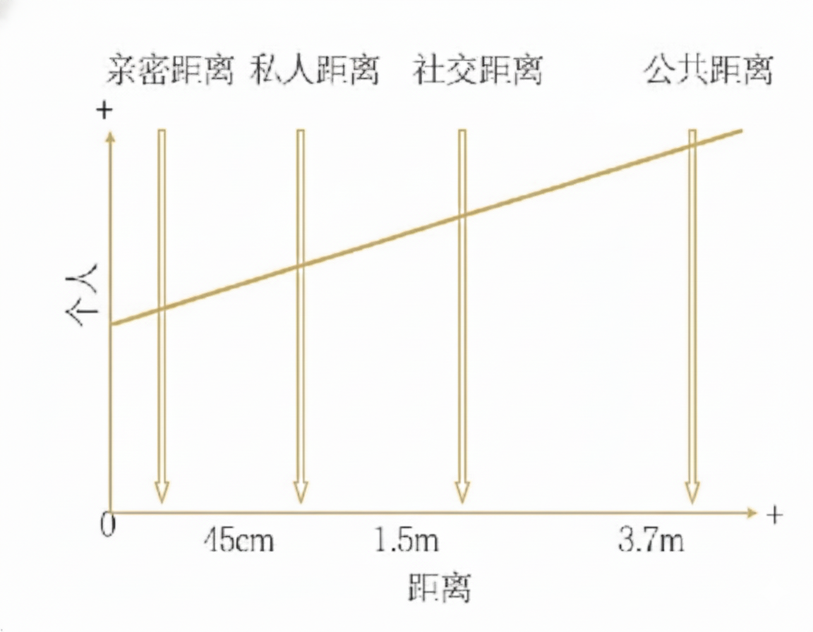

---
tags:
  - 了不起的身体语言
  - psychology
---

人类有强烈的领地意识，当领地被侵入或侵犯时会立刻察觉到。空间关系对日常生活会产生巨大的影响。

## 空间关系学

维护空间主权以求内心的满足常常是人类下意识的行为。

### 个人空间

- 每个人都有个人空间，进入对方的个人空间可能会有一定的风险。
- 人际距离传达接纳、鼓励或拒绝之意。简而言之，如果你喜欢或想支持某人，那你会靠近他们，反之则不然。

### 空间关系距离

四种主要的空间关系距离：

- 出于本能，我们明白自己想与他人保持何种距离。
-  当他人闯入我们的私人空间时，我们会感到不适。
- 我们通过靠近他人来表示自己的好感。
- 彼此微笑表示双方会进一步拉近距离。