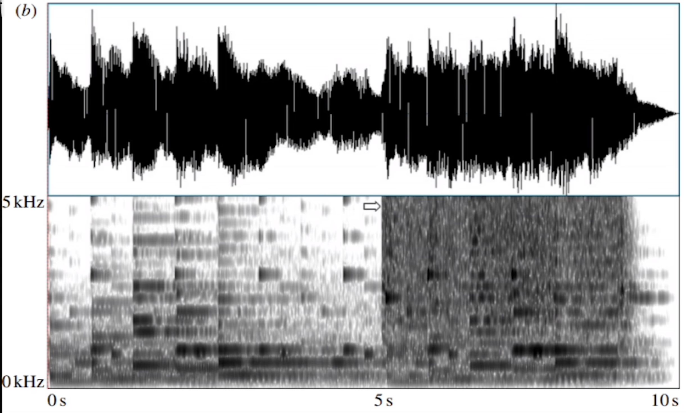

## 生理性原理

### 先天性 vs 获得性差异

每个人对恐怖的感知有差别，即“胆子大”和“胆子小”

**黑箱理论：** 恐惧是介于“输入”（掠食者、疼痛）与“输出”（逃跑、战斗、僵直）之间的黑箱，是神经反应与生理变化的结合 。

**生理构造影响胆量：**

- **胆小：** 岛叶皮层和腹内侧前额叶较厚的人，受刺激时反应更大，更难走出恐惧情绪 。
- **杏仁核活动：** 恐惧发生时，杏仁核表现为**高频率**伴随**不低的活动量**（不同于愤怒的爆发式或悲伤的细水长流）。这也是为什么Jump Scare（突发惊吓）会让人产生激灵并伴随“后怕” 。

- **后天影响：** 通过训练或文化灌输，人可以建立对恐怖的耐受，也可能被植入恐惧（如“小艾伯特”实验） 。

### 应对恐惧的策略

- **暴露疗法（直面恐惧）：** 在可控环境下（如鬼屋）主动寻求惊吓通常能获得愉悦感，而被动强迫则会带来创伤。关键在于**是否拥有心理准备和接受意愿** 。
- **祛魅与幽默：** 通过开玩笑、讲脏话等方式将恐惧对象物化和解构，让人高效脱离恐怖情境 。
- **恐惧管理理论 (Terror Management Theory)：**
  - 当面对死亡恐惧时，人们会通过提升自尊、捍卫价值观来对抗。
  - **哲学升华：** 赋予自我更宏大的意义（如坚信正义必胜），使恐惧对象变得渺小 。
- **审美化/娱乐化：** 如重金属音乐中的“Brutal”或“Cult”文化，将恐怖视为一种可掌控的力量和审美享受 。

## 恐怖氛围的制造方法

电影通过延长现实体验，让我们在安全环境中进行极端猜想 。

### 1. 环境 (Environment)

- **表现主义：** 如《卡里加利博士的小屋》，通过扭曲、抽象的建筑映衬人物精神状态 。
- **日常场景陌生化：**
  - **空间异化：** 《电锯惊魂》将肮脏卫生间变为牢笼；《遗传厄运》在微缩模型与真实建筑间切换，暗示被操纵的命运 。
  - **日式恐怖：** 让熟悉的楼道、电梯、办公室发生异变，侵入日常观察方式 。
- **克苏鲁式/神秘主义：** 赋予环境一种目的不明但压倒性的力量。如《女巫》中的森林、《湮灭》中不可理解的外星生态，呈现一种不带人性的俯瞰视角 。

### 2. 声音 (Sound)

- **重要性：** “恐怖感主要基于声音传播”，关掉声音恐怖感减少一半 。
- **环境音效：**
  - **雷雨夜：** 干扰视听，阻断求救，白噪音放大紧张感（随机共振） 。
  - **非线性声音：** 刺耳、不和谐、难以预测的声音（UCLA研究），直接引发本能不安 。

- **特殊乐器与技法：**
  - **水琴 (Waterphone)：** 声音空灵诡异，恐怖片常客 。
  
  <video src="/Users/aurora/Desktop/视频/for typora/最让人感到恐惧孤独的乐器—水琴 - 001 - 最让人感到恐惧孤独的乐器—水琴.mp4" controls="controls" width="100%"></video>
  
  - **倒放 (Backmasking)：** “魔鬼的语言”，因信息**被阻碍且形式颠倒**而显得邪恶（如《驱魔人》） 。
  - **三全音 (Tritone)：** 中世纪被禁的“音乐中的魔鬼”，表征数字666，听感极度不和谐（如黑色安息日乐队） 。

### 3. 情节与角色 (Plot & Character)

- **情节反转与悲剧性：**
  - 打破安全感，建立在严谨铺垫之上的毁灭。
  - **案例：** 《马柔本宅秘事》（全员已死，主角精神分裂）、《见鬼》（镜子里的人不是自己） 。
- **恐怖谷理论：** 像人又非人的形象（如僵尸、变异体）最易引发恶心与恐惧 。
- **反派角色的表演体系：**
  - **体验派（《生吃》）：** 将情欲转化为杀意，逻辑连贯的病态热恋 。
  - **表现派（《老无所依》）：** 设计精密的情绪动作，通过造型（如怪异发型）制造疏离感和恶心感 。
  - **方法派（《罪恶之城》）：** 将杀戮视为平常，甚至无视自身痛觉，呈现绝对的冷漠与非人性 。

## 三、 恐怖的深意与哲学

### 1. 社会性集体焦虑

- 恐怖片往往揭示了特定时期和地域的社会焦虑。
- **案例：** 《罗斯玛丽的婴儿》（1968年）反映了美国60年代的消费主义、越战阴影、家庭伦理危机及药物致畸恐慌 。

### 2. 东西方差异

- **东方：** 侧重怨念、诅咒，体现为内化的生死观 。
- **西方：** 侧重恶魔、外在威胁 。

### 3. 终极恐惧：虚无与死亡

- 恐惧的根源是**未知**、**无限**和**可能性**。
- **死亡的本质：** 最大的恐惧是将人逼向死亡。死不是另一种生，而是与“存在”完全结合的虚无 。
- **存在的意义：** 直面虚无是一场无尽的求索，恐怖让我们在终极自由面前决断，从而牢牢攥紧求生欲 。

